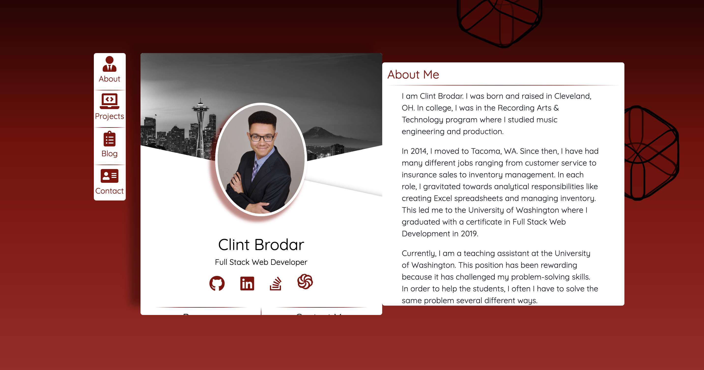

# Clint Brodar Portfolio

## A portfolio of my projects, social media post and work experience.

## View Project
[Portfolio](http://cb721.github.io/ClintBrodarPortfolio)

* The main panel includes a picture of me as well as an image of Seattle with links to my GitHub repository and LinkedIn profile.

* The About section includes a short section that describes my experience, goals and some fun facts about myself.

* The Projects section includes pictures and details of projects I've worked on.  Each one highlights problems I faced and how I overcame them.  There is a link to the deployed project at the bottom of the description.  Projects can be filtered by Front End, Back End, Data Analytics And Game Development.

* The Blog section includes a picture and link to my LinkedIn posts.

* The Contact section includes my contact information.

### Technologies Used

* React.js
* Javascript(ES6)
* HTML/SCSS
